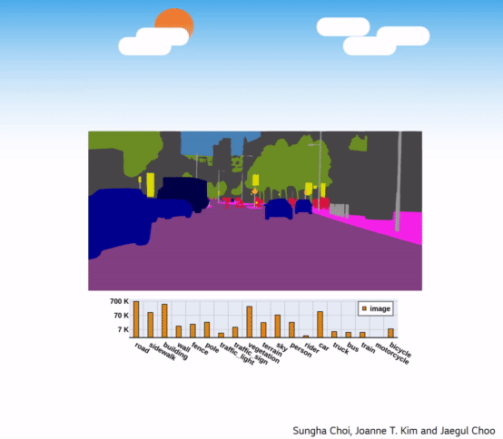
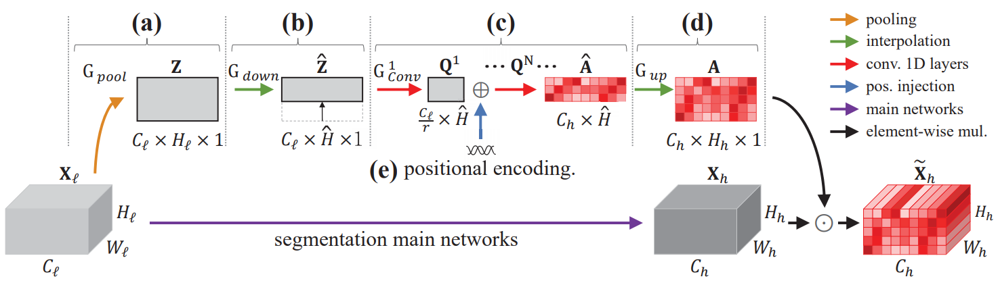
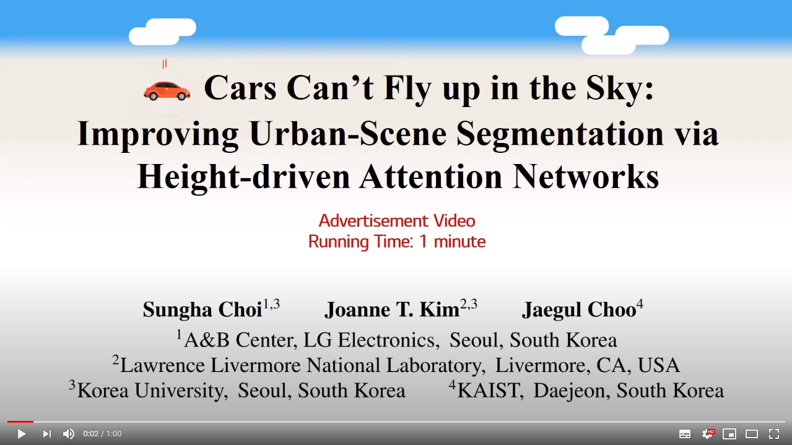

## HANet: Official Project Webpage
HANet is an add-on module for urban-scene segmentation to exploit the structural priors existing in urban-scene. It is effective and wide applicable!

<p align="center">
  
</p>

This repository provides the official PyTorch implementation of the following paper:
> **Cars Can’t Fly up in the Sky:** Improving Urban-Scene Segmentation via Height-driven Attention Networks<br>
> Sungha Choi (LGE, Korea Univ.), Joanne T. Kim (LLNL, Korea Univ.), Jaegul Choo (KAIST)<br>
> In CVPR 2020<br>

> Paper : https://arxiv.org/abs/2003.05128 <br>

<p align="center">
  
</p>

> **Abstract:** *This paper exploits the intrinsic features of urban-scene images and proposes a general add-on module, called height driven attention networks (HANet), for improving semantic segmentation for urban-scene images. It emphasizes informative features or classes selectively according to the vertical position of a pixel. The pixel-wise class distributions are significantly different from each other among horizontally segmented sections in the urban-scene images. Likewise, urban-scene images have their own distinct characteristics, but most semantic segmentation networks do not reflect such unique attributes in the architecture. The proposed network architecture incorporates the capability exploiting the attributes to handle the urban scene dataset effectively. We validate the consistent performance (mIoU) increase of various semantic segmentation models on two datasets when HANet is adopted. This extensive quantitative analysis demonstrates that adding our module to existing models is easy and cost-effective. Our method achieves a new state-of-the-art performance on the Cityscapes benchmark with a large margin among ResNet-101 based segmentation models. Also, we show that the proposed model is coherent with the facts observed in the urban scene by visualizing and interpreting the attention map*<br>

## Concept Video
Click the figure to watch the youtube video of our paper!

<p align="center">
  <a href="https://www.youtube.com/watch?v=0Orj3AUfu9Y"></a><br>
</p>

## Cityscapes Benchmark
| Models | Data | mIoU | External Link |
|:--------:|:--------:|:--------:|:--------:|
| HANet (ResNext-101) | Fine train/val + Coarse | 83.2% | [Cityscapes benchmark](https://www.cityscapes-dataset.com/anonymous-results/?id=9a8b7333dcb66360b4f38ba00db7c84e7997f7203084bf6e92ca9bbabbc34640) |
| HANet (ResNet-101) | Fine train/val | 82.1% | [Cityscapes benchmark](https://www.cityscapes-dataset.com/anonymous-results/?id=f96818d678c67c82449323203d144e530fb66102a5b5a101f599a96cc62458e7) |
| HANet (ResNet-101) | Fine train | 80.9% | [Cityscapes benchmark](https://www.cityscapes-dataset.com/anonymous-results/?id=1e5e85818e439332fdae01037259706d9091be2b9fca850eb4a851805f5ed44d) |


## Pytorch Implementation
### Installation
Clone this repository.
```
git clone https://github.com/shachoi/HANet.git
cd HANet
```
Install following packages.
```
conda create --name hanet python=3.6
conda activate hanet
conda install -y pytorch=1.4.0 torchvision=0.5.0 cudatoolkit=10.1 -c pytorch
conda install scipy==1.4.1
conda install tqdm==4.46.0
conda install scikit-image==0.16.2
pip install tensorboardX==2.0
pip install thop
```

### Datasets
We evaludated HANet on [Cityscapes](https://www.cityscapes-dataset.com/) and [BDD-100K](https://bair.berkeley.edu/blog/2018/05/30/bdd/).

For Cityscapes dataset, download "leftImg8bit_trainvaltest.zip" and "gtFine_trainvaltest.zip" from https://www.cityscapes-dataset.com/downloads/<br>
Unzip the files and make the directory structures as follows.
```
cityscapes
 └ leftImg8bit_trainvaltest
   └ leftImg8bit
     └ train
     └ val
     └ test
 └ gtFine_trainvaltest
   └ gtFine
     └ train
     └ val
     └ test
```
You should modify the path in **"<path_to_hanet>/config.py"** according to your Cityscapes dataset path.

```
#Cityscapes Dir Location
__C.DATASET.CITYSCAPES_DIR = <YOUR_CITYSCAPES_PATH>
```

Additionally, you can use Cityscapes coarse dataset to get best mIoU score.

Please refer the training script **"<path_to_hanet>/scripts/train_resnext_fr_pretrain.sh"**.

The other training scripts don't use Cityscapes coarse dataset.

### Pretrained Models
#### All models trained for our paper
You can download all models evaluated in our paper at [Google Drive](https://drive.google.com/drive/folders/1qetciC7G29Gg4iKHLWhCioSdMbmYeb0Y?usp=sharing)

#### ImageNet pretrained ResNet-101 which has three 3×3 convolutions in the first layer
To train ResNet-101 based HANet, you should download ImageNet pretrained ResNet-101 from [this link](https://drive.google.com/file/d/1jMx3HdVqSlpIYIyG3VPi8q-ZiclOHlc7/view?usp=sharing). Put it into following directory.
```
<path_to_hanet>/pretrained/resnet101-imagenet.pth
```
This pretrained model is from [MIT CSAIL Computer Vision Group](http://sceneparsing.csail.mit.edu/)

#### Mapillary pretrained ResNext-101
You can finetune HANet from Mapillary pretrained ResNext-101.
Download from [this link](https://drive.google.com/file/d/1GJ4VOSiLwNuyqOgRqQoe9FbvnklI2TYe/view?usp=sharing) and put it into following directory.
```
<path_to_hanet>/pretrained/resnext_mapillary_0.47475.pth
```
### Training Networks
According to the specification of your gpu system, you may modify the training script.
```
     python -m torch.distributed.launch --nproc_per_node=NUM_GPUS_YOU_HAVE train.py \  
      ...
      --bs_mult NUM_BATCH_PER_SINGLE_GPU \
      ...
```
You can train HANet (based on ResNet-101) using finely annotated **training and validation** set with following command.
```
<path_to_hanet>$ CUDA_VISIBLE_DEVICES=0,1,2,3 ./scripts/train_r101_os8_hanet_best.sh
```
Otherwise, you can train HANet (based on ResNet-101) using only finely annotated **training** set with following command.
```
<path_to_hanet>$ CUDA_VISIBLE_DEVICES=0,1,2,3 ./scripts/train_r101_os8_hanet.sh
```
Additioanlly, we provide various training scripts like MobileNet based HANet.

The results will be stored in **"<path_to_hanet>/logs/"**
### Inference
```
<path_to_hanet>$ CUDA_VISIBLE_DEVICES=0 ./scripts/eval_r101_os8.sh <weight_file_location> <result_save_location>
```
### Submit to Cityscapes benchmark server
```
<path_to_hanet>$ CUDA_VISIBLE_DEVICES=0 ./scripts/submit_r101_os8.sh <weight_file_location> <result_save_location>
```

## Citation
If you find this work useful for your research, please cite our paper:
```
@inproceedings{choi2020cars,
  title={Cars Can't Fly up in the Sky: Improving Urban-Scene Segmentation via Height-driven Attention Networks},
  author={Choi, Sungha and Kim, Joanne T and Choo, Jaegul},
  booktitle={Proceedings of the IEEE Conference on Computer Vision and Pattern Recognition},
  year={2020}
}
```

## Acknowledgments
Our pytorch implementation is heavily derived from [NVIDIA segmentation](https://github.com/NVIDIA/semantic-segmentation).
Thanks to the NVIDIA implementations.
